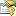

# UxrWeapon Properties
 

The <a href="T_UltimateXR_Mechanics_Weapons_UxrWeapon">UxrWeapon</a> type exposes the following members.

## Properties
&nbsp;<table><tr><th></th><th>Name</th><th>Description</th></tr><tr><td></td><td><a href="P_UltimateXR_Mechanics_Weapons_UxrWeapon_IsGrabbableObjectRequired">IsGrabbableObjectRequired</a></td><td>
Gets whether the grabbable object component is required or it's not. By default it is required but it can be overriden in child classes so that it is optional.
 (Overrides <a href="P_UltimateXR_Core_Components_Composite_UxrGrabbableObjectComponent_1_IsGrabbableObjectRequired">UxrGrabbableObjectComponent(T).IsGrabbableObjectRequired</a>.)</td></tr><tr><td></td><td><a href="P_UltimateXR_Mechanics_Weapons_UxrWeapon_Owner">Owner</a></td><td>
Gets who is in possession of the weapon, to attribute the inflicted damage to.</td></tr></table>&nbsp;
<a href="#uxrweapon-properties">Back to Top</a>

## See Also

#### Reference
<a href="T_UltimateXR_Mechanics_Weapons_UxrWeapon">UxrWeapon Class</a> <a href="N_UltimateXR_Mechanics_Weapons">UltimateXR.Mechanics.Weapons Namespace</a> 